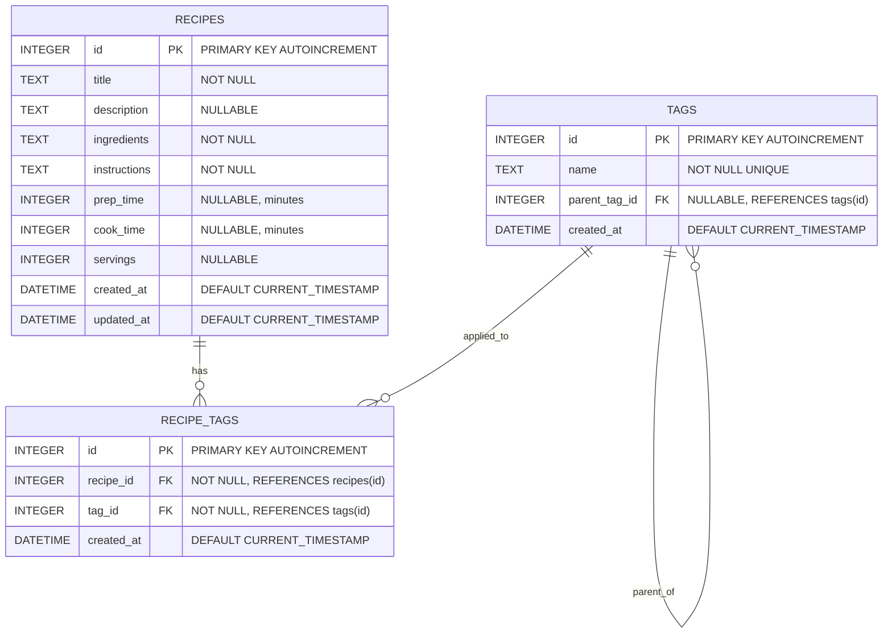

# Database Schema Documentation

## Overview

The Recipe Management application uses SQLite as its primary database, providing a lightweight yet robust solution for data persistence. The schema is designed to support hierarchical tag organization, recipe management, and many-to-many relationships between recipes and tags.

## Schema Design Principles

- **Referential Integrity**: Foreign key constraints ensure data consistency
- **ACID Compliance**: Transaction support for complex operations
- **Hierarchical Structure**: Self-referencing tags for category organization
- **Extensibility**: Schema supports future feature additions
- **Performance**: Optimized indexes for common query patterns

## Entity Relationship Diagram (ERD)



## Table Specifications

### recipes

Stores core recipe information including content, metadata, and timing details.

| Column | Type | Constraints | Description |
|--------|------|-------------|-------------|
| `id` | INTEGER | PRIMARY KEY, AUTOINCREMENT | Unique recipe identifier |
| `title` | TEXT | NOT NULL | Recipe name/title |
| `description` | TEXT | NULLABLE | Optional recipe description |
| `ingredients` | TEXT | NOT NULL | Formatted ingredients list |
| `instructions` | TEXT | NOT NULL | Step-by-step cooking instructions |
| `prep_time` | INTEGER | NULLABLE | Preparation time in minutes |
| `cook_time` | INTEGER | NULLABLE | Cooking time in minutes |
| `servings` | INTEGER | NULLABLE | Number of servings recipe produces |
| `created_at` | DATETIME | DEFAULT CURRENT_TIMESTAMP | Record creation timestamp |
| `updated_at` | DATETIME | DEFAULT CURRENT_TIMESTAMP | Last modification timestamp |

#### Indexes
```sql
-- Automatic index on PRIMARY KEY (id)
-- Consider adding index on title for search optimization
CREATE INDEX IF NOT EXISTS idx_recipes_title ON recipes(title);
CREATE INDEX IF NOT EXISTS idx_recipes_created_at ON recipes(created_at DESC);
```

#### Constraints
```sql
-- Title must not be empty
CHECK (length(trim(title)) > 0)

-- Time values must be positive if provided
CHECK (prep_time IS NULL OR prep_time >= 0)
CHECK (cook_time IS NULL OR cook_time >= 0)
CHECK (servings IS NULL OR servings > 0)
```

### tags

Implements hierarchical tag system with self-referencing parent-child relationships.

| Column | Type | Constraints | Description |
|--------|------|-------------|-------------|
| `id` | INTEGER | PRIMARY KEY, AUTOINCREMENT | Unique tag identifier |
| `name` | TEXT | NOT NULL, UNIQUE | Tag name/label |
| `parent_tag_id` | INTEGER | NULLABLE, FOREIGN KEY | References parent tag for hierarchy |
| `created_at` | DATETIME | DEFAULT CURRENT_TIMESTAMP | Record creation timestamp |

#### Foreign Key Constraints
```sql
FOREIGN KEY (parent_tag_id) REFERENCES tags(id) ON DELETE SET NULL
```

#### Indexes
```sql
-- Automatic index on PRIMARY KEY (id)
-- Automatic index on UNIQUE constraint (name)
CREATE INDEX IF NOT EXISTS idx_tags_parent_id ON tags(parent_tag_id);
```

#### Hierarchical Structure
- **Root Tags**: `parent_tag_id = NULL`
- **Child Tags**: `parent_tag_id` references parent's `id`
- **Max Depth**: No enforced limit (recommend 3-4 levels for UX)

#### Constraints
```sql
-- Tag name must not be empty
CHECK (length(trim(name)) > 0)

-- Prevent self-referencing (tag cannot be its own parent)
CHECK (parent_tag_id != id)
```

### recipe_tags

Junction table implementing many-to-many relationship between recipes and tags.

| Column | Type | Constraints | Description |
|--------|------|-------------|-------------|
| `id` | INTEGER | PRIMARY KEY, AUTOINCREMENT | Unique relationship identifier |
| `recipe_id` | INTEGER | NOT NULL, FOREIGN KEY | References recipes.id |
| `tag_id` | INTEGER | NOT NULL, FOREIGN KEY | References tags.id |
| `created_at` | DATETIME | DEFAULT CURRENT_TIMESTAMP | Relationship creation timestamp |

#### Foreign Key Constraints
```sql
FOREIGN KEY (recipe_id) REFERENCES recipes(id) ON DELETE CASCADE
FOREIGN KEY (tag_id) REFERENCES tags(id) ON DELETE CASCADE
```

#### Indexes
```sql
-- Automatic index on PRIMARY KEY (id)
CREATE INDEX IF NOT EXISTS idx_recipe_tags_recipe_id ON recipe_tags(recipe_id);
CREATE INDEX IF NOT EXISTS idx_recipe_tags_tag_id ON recipe_tags(tag_id);

-- Composite index for efficient joins
CREATE INDEX IF NOT EXISTS idx_recipe_tags_composite ON recipe_tags(recipe_id, tag_id);
```

#### Constraints
```sql
-- Prevent duplicate recipe-tag associations
UNIQUE(recipe_id, tag_id)
```

## Database Creation Script

```sql
-- Enable foreign key constraints
PRAGMA foreign_keys = ON;

-- Create recipes table
CREATE TABLE IF NOT EXISTS recipes (
    id INTEGER PRIMARY KEY AUTOINCREMENT,
    title TEXT NOT NULL CHECK (length(trim(title)) > 0),
    description TEXT,
    ingredients TEXT NOT NULL,
    instructions TEXT NOT NULL,
    prep_time INTEGER CHECK (prep_time IS NULL OR prep_time >= 0),
    cook_time INTEGER CHECK (cook_time IS NULL OR cook_time >= 0),
    servings INTEGER CHECK (servings IS NULL OR servings > 0),
    created_at DATETIME DEFAULT CURRENT_TIMESTAMP,
    updated_at DATETIME DEFAULT CURRENT_TIMESTAMP
);

-- Create tags table with hierarchical support
CREATE TABLE IF NOT EXISTS tags (
    id INTEGER PRIMARY KEY AUTOINCREMENT,
    name TEXT NOT NULL UNIQUE CHECK (length(trim(name)) > 0),
    parent_tag_id INTEGER,
    created_at DATETIME DEFAULT CURRENT_TIMESTAMP,
    FOREIGN KEY (parent_tag_id) REFERENCES tags(id) ON DELETE SET NULL,
    CHECK (parent_tag_id != id)
);

-- Create junction table for many-to-many relationships
CREATE TABLE IF NOT EXISTS recipe_tags (
    id INTEGER PRIMARY KEY AUTOINCREMENT,
    recipe_id INTEGER NOT NULL,
    tag_id INTEGER NOT NULL,
    created_at DATETIME DEFAULT CURRENT_TIMESTAMP,
    FOREIGN KEY (recipe_id) REFERENCES recipes(id) ON DELETE CASCADE,
    FOREIGN KEY (tag_id) REFERENCES tags(id) ON DELETE CASCADE,
    UNIQUE(recipe_id, tag_id)
);

-- Create performance indexes
CREATE INDEX IF NOT EXISTS idx_recipes_title ON recipes(title);
CREATE INDEX IF NOT EXISTS idx_recipes_created_at ON recipes(created_at DESC);
CREATE INDEX IF NOT EXISTS idx_tags_parent_id ON tags(parent_tag_id);
CREATE INDEX IF NOT EXISTS idx_recipe_tags_recipe_id ON recipe_tags(recipe_id);
CREATE INDEX IF NOT EXISTS idx_recipe_tags_tag_id ON recipe_tags(tag_id);
CREATE INDEX IF NOT EXISTS idx_recipe_tags_composite ON recipe_tags(recipe_id, tag_id);

-- Trigger to update updated_at timestamp
CREATE TRIGGER IF NOT EXISTS update_recipes_updated_at
    AFTER UPDATE ON recipes
BEGIN
    UPDATE recipes SET updated_at = CURRENT_TIMESTAMP WHERE id = NEW.id;
END;
```

## Common Query Patterns

### Recipe Queries

#### Get all recipes with their tags
```sql
SELECT 
    r.*,
    JSON_GROUP_ARRAY(
        JSON_OBJECT('id', t.id, 'name', t.name, 'parent_tag_id', t.parent_tag_id)
    ) as tags
FROM recipes r
LEFT JOIN recipe_tags rt ON r.id = rt.recipe_id
LEFT JOIN tags t ON rt.tag_id = t.id
GROUP BY r.id
ORDER BY r.created_at DESC;
```

#### Get specific recipe with tags
```sql
SELECT 
    r.*,
    JSON_GROUP_ARRAY(
        JSON_OBJECT('id', t.id, 'name', t.name, 'parent_tag_id', t.parent_tag_id)
    ) as tags
FROM recipes r
LEFT JOIN recipe_tags rt ON r.id = rt.recipe_id
LEFT JOIN tags t ON rt.tag_id = t.id
WHERE r.id = ?
GROUP BY r.id;
```

#### Search recipes by text and tags
```sql
SELECT DISTINCT r.*
FROM recipes r
LEFT JOIN recipe_tags rt ON r.id = rt.recipe_id
LEFT JOIN tags t ON rt.tag_id = t.id
WHERE 
    (r.title LIKE ? OR r.description LIKE ? OR r.ingredients LIKE ? OR r.instructions LIKE ?)
    AND r.id IN (
        SELECT rt2.recipe_id 
        FROM recipe_tags rt2 
        JOIN tags t2 ON rt2.tag_id = t2.id 
        WHERE t2.name IN (?, ?, ...)
        GROUP BY rt2.recipe_id 
        HAVING COUNT(DISTINCT t2.name) = ?
    )
ORDER BY r.created_at DESC;
```

### Tag Queries

#### Get tag hierarchy
```sql
-- Recursive CTE for full hierarchy
WITH RECURSIVE tag_hierarchy AS (
    -- Base case: root tags
    SELECT id, name, parent_tag_id, 0 as level, name as path
    FROM tags 
    WHERE parent_tag_id IS NULL
    
    UNION ALL
    
    -- Recursive case: child tags
    SELECT t.id, t.name, t.parent_tag_id, th.level + 1, th.path || ' > ' || t.name
    FROM tags t
    JOIN tag_hierarchy th ON t.parent_tag_id = th.id
)
SELECT * FROM tag_hierarchy ORDER BY path;
```

#### Get recipes using specific tag
```sql
SELECT r.id, r.title, r.description
FROM recipes r
JOIN recipe_tags rt ON r.id = rt.recipe_id
WHERE rt.tag_id = ?
ORDER BY r.title;
```

#### Get tag usage statistics
```sql
SELECT 
    t.id,
    t.name,
    COUNT(rt.recipe_id) as recipe_count,
    t.parent_tag_id
FROM tags t
LEFT JOIN recipe_tags rt ON t.id = rt.tag_id
GROUP BY t.id, t.name, t.parent_tag_id
ORDER BY recipe_count DESC, t.name;
```

## Data Integrity Rules

### Referential Integrity
1. **Recipe-Tag Relationships**: Automatically cascade on recipe/tag deletion
2. **Tag Hierarchy**: Parent deletion sets children's parent_tag_id to NULL
3. **Unique Constraints**: Prevent duplicate tag names and recipe-tag associations

### Business Rules
1. **Required Fields**: Recipes must have title, ingredients, and instructions
2. **Positive Values**: Time and serving values must be positive when provided
3. **Hierarchy Validation**: Tags cannot reference themselves as parents
4. **Name Validation**: Tag and recipe names cannot be empty or whitespace-only

### Transaction Guidelines
1. **Recipe Updates**: Use transactions when updating recipes with tags
2. **Tag Deletion**: Use transactions to handle cascade effects
3. **Bulk Operations**: Batch inserts/updates within transactions
4. **Error Recovery**: Implement rollback on constraint violations

## Performance Considerations

### Indexing Strategy
- **Primary Keys**: Automatic clustered indexes
- **Foreign Keys**: Indexed for join performance
- **Search Fields**: Index on recipe title for text search
- **Composite Index**: recipe_tags(recipe_id, tag_id) for efficient joins

### Query Optimization
- **JSON Aggregation**: Use JSON functions for tag collections
- **Hierarchical Queries**: CTEs for tag tree traversal
- **Search Queries**: Full-text search extensions for large datasets
- **Pagination**: LIMIT/OFFSET for large result sets

### Scalability Notes
- **SQLite Limits**: 140TB database size, 32K page size
- **Concurrent Access**: Reader-writer locks, WAL mode for better concurrency
- **Migration Path**: Schema supports migration to PostgreSQL/MySQL if needed

## Migration and Versioning

### Schema Versioning
```sql
-- Version tracking table
CREATE TABLE IF NOT EXISTS schema_version (
    version INTEGER PRIMARY KEY,
    applied_at DATETIME DEFAULT CURRENT_TIMESTAMP,
    description TEXT
);

-- Current version
INSERT OR REPLACE INTO schema_version (version, description) 
VALUES (1, 'Initial schema with recipes, tags, and recipe_tags');
```

### Future Enhancements
1. **User Management**: Add users table with recipe ownership
2. **Recipe Ratings**: Add ratings/reviews tables
3. **Nutrition Data**: Extend recipes with nutritional information
4. **Media Support**: Add tables for recipe images and videos
5. **Collections**: Add recipe collections/cookbooks functionality

---

*This schema documentation follows database design best practices and SQLite-specific optimizations. Schema changes should be versioned and backwards-compatible when possible.*